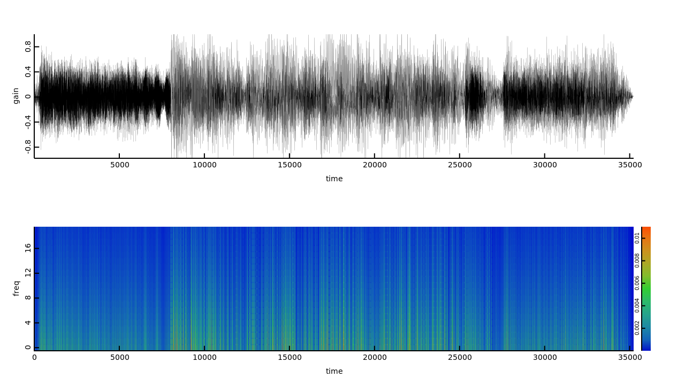

# d-wavelet

wavelet analysis tool in D

```
$ dub build
$ ./d-wavelet --input foo.wav --output foo.png --bin 25
```

## examples

[speech](http://www.wavsource.com/snds_2017-03-05_7549739125831384/people/women/activity_unproductive.wav)


[music](http://www.wavsource.com/snds_2017-03-05_7549739125831384/tv/batman/batman_theme_x.wav)

